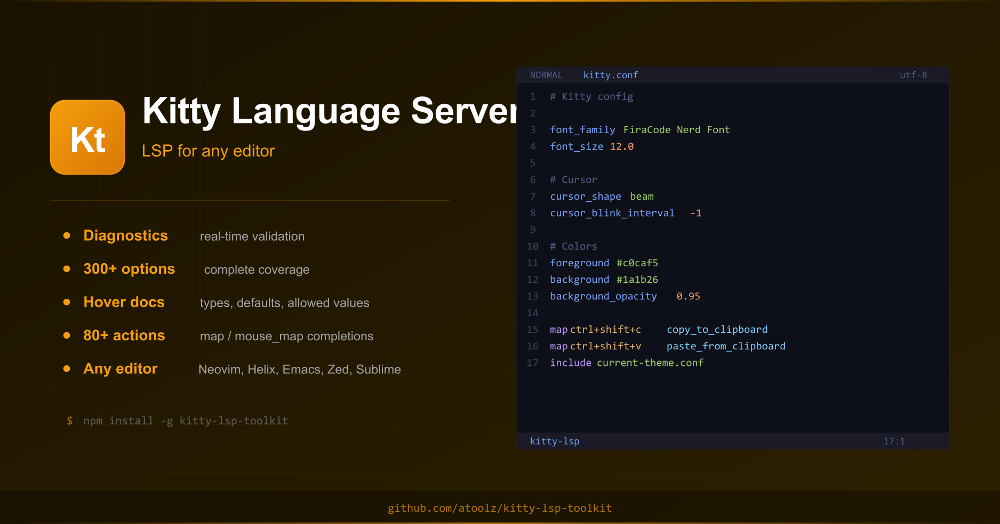
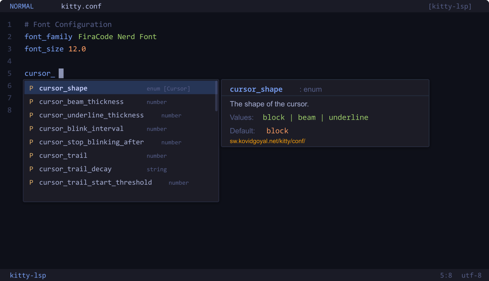
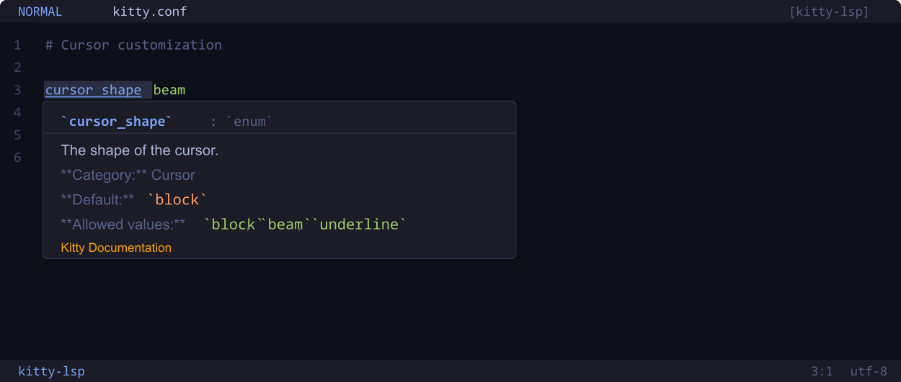
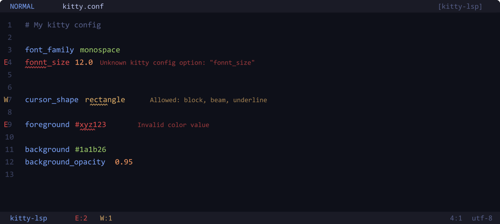

<p align="center">
  
</p>

<h1 align="center">Kitty Language Server</h1>

<p align="center">
  <strong>LSP server for <code>kitty.conf</code> with diagnostics, completions, and hover documentation for any editor</strong>
</p>

<p align="center">
  <a href="https://www.npmjs.com/package/kitty-lsp-toolkit">
    
  </a>
  <a href="https://www.npmjs.com/package/kitty-lsp-toolkit">
    
  </a>
  <a href="https://github.com/atoolz/kitty-lsp-toolkit/blob/main/LICENSE">
    
  </a>
  <a href="https://sw.kovidgoyal.net/kitty/">
    
  </a>
</p>

---

[Kitty](https://sw.kovidgoyal.net/kitty/) is a fast, feature-rich, GPU-based terminal emulator. This language server brings IntelliSense, validation, and documentation for `kitty.conf` to any editor that supports the [Language Server Protocol](https://microsoft.github.io/language-server-protocol/) (Neovim, Helix, Emacs, Zed, Sublime Text, and more).

## Features

### IntelliSense Completions

Context-aware autocompletion for all 300+ kitty options, directives, and actions.

- **Option names** with descriptions, types, defaults, and snippet insertion
- **Enum values** for options like `cursor_shape`, `tab_bar_style`, `placement_strategy`
- **Color values** with hex presets from popular themes (Gruvbox, Catppuccin, Dracula, Solarized)
- **Map actions** for `map` and `mouse_map` directives (80+ actions)
- **Directive snippets** for `map`, `mouse_map`, `include`, `globinclude`, `env`

<p align="center">
  
</p>

### Hover Documentation

Hover over any option to see its description, type, default value, allowed values, and a link to the kitty docs.

<p align="center">
  
</p>

### Diagnostics and Validation

Real-time validation catches configuration errors as you type:

- Unknown option names
- Invalid boolean values (only `yes`/`no` are valid in kitty)
- Invalid number values
- Invalid enum values with the list of accepted alternatives
- Invalid color formats

<p align="center">
  
</p>

## Installation

```bash
npm install -g @atoolz/kitty-lsp-toolkit
```

This installs the `kitty-lsp` binary globally.

## Editor Setup

### Neovim

```lua
vim.api.nvim_create_autocmd("FileType", {
  pattern = "kitty",
  callback = function()
    vim.lsp.start({
      name = "kitty-lsp",
      cmd = { "kitty-lsp" },
    })
  end,
})
```

To detect `kitty.conf` as filetype `kitty`, add to your `init.lua`:

```lua
vim.filetype.add({
  filename = {
    ["kitty.conf"] = "kitty",
  },
  pattern = {
    [".*/kitty/.*%.conf"] = "kitty",
  },
})
```

### Helix

Add to `~/.config/helix/languages.toml`:

```toml
[language-server.kitty-lsp]
command = "kitty-lsp"

[[language]]
name = "kitty"
scope = "source.kitty"
file-types = [{ glob = "kitty.conf" }, { glob = "*/kitty/*.conf" }]
language-servers = ["kitty-lsp"]
```

### Emacs (lsp-mode)

```elisp
(with-eval-after-load 'lsp-mode
  (add-to-list 'lsp-language-id-configuration '(".*kitty.*\\.conf$" . "kitty"))
  (lsp-register-client
   (make-lsp-client
    :new-connection (lsp-stdio-connection '("kitty-lsp"))
    :activation-fn (lsp-activate-on "kitty")
    :server-id 'kitty-lsp)))
```

### Sublime Text (LSP package)

Add to LSP settings:

```json
{
  "clients": {
    "kitty-lsp": {
      "command": ["kitty-lsp"],
      "selector": "source.kitty"
    }
  }
}
```

### Zed

Add to your Zed settings:

```json
{
  "lsp": {
    "kitty-lsp": {
      "binary": {
        "path": "kitty-lsp"
      }
    }
  }
}
```

## Supported Categories

All major kitty configuration categories are covered:

`Fonts` `Cursor` `Scrollback` `Mouse` `Performance` `Terminal Bell` `Window Layout` `Tab Bar` `Colors` `Advanced`

## VS Code

For VS Code, use the companion extension [Kitty Toolkit](https://marketplace.visualstudio.com/items?itemName=atoolz.kitty-vscode-toolkit) which includes syntax highlighting, snippets, and all features from this LSP built-in.

## Contributing

Contributions are welcome. Please open an issue or pull request on [GitHub](https://github.com/atoolz/kitty-lsp-toolkit).

## License

[MIT](LICENSE)
